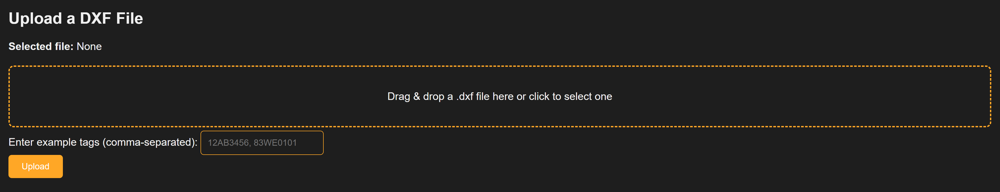

# P&ID DXF Scraper

A tool used to gather tag names from a Process and Instrumentation diagram through a web browser. Supports visualization of sheets with their tag locations, as well as exporting the data in Excel format for a device list. Use the "Tag Pattern" field to specify a pattern of tags that the scraper can look for, seperated by commas. 

# Installation

Install the required libraries with the following:
```
pip install flask pandas ezdxf plotly
```
# Demo


